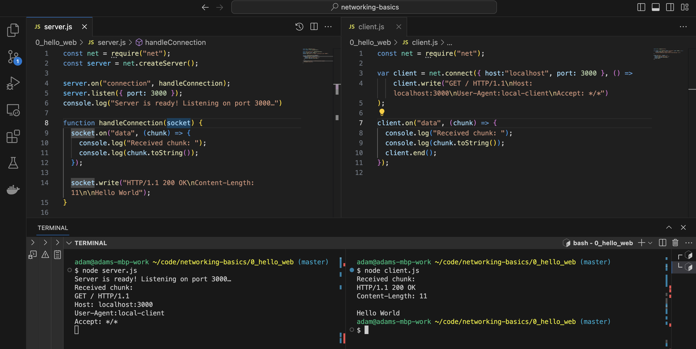

# Networking Introduction for Programmers

This repository is meant to accompany lectures given at C<>DE University. This repository contains many versions of low-level servers and clients, intended to demonstrate various principles of how web servers work, including sockets, HTTP requests, file servers, etc. 

## Before We Begin...

Students joining this workshop are expected to have:
- An interest in learning how the internet works
- Basic familiarity with the terminal and command line on your own computer (e.g. navigating directories, executing scripts)
- Node.js installed on your computer (ideally v18, but v16 or v20 is OK)
- Optional: Python3 installed on your computer (v3.8 or higher)
- Optional: git installed on your own computer, and the ability to clone a repository (nothing advanced required).
- A code editor / integrated development environment installed locally on your computer (e.g. Visual Studio Code).

To start, clone this repository into a working directory on your computer and open it in your code editor. You can do this by opening a New Window in Visual Studio Code selecting "Clone Git Repository", entering the URL of this repository (copied from your browser), and then selecting a local directory to save it to. You can also download this repository as a .zip file instead and open it from the downloads folder. 

### Lesson 0: Hello, Web! 
In this lesson, we'll start our first web server. 

Navigate to the directory `0_hello_web` in your terminal and run the server using node.js:

`> node server.js`

It should be running now. It will look like it is hanging, because it is running and waiting for input. Open the file `server.js` in your code editor, and you can see that is is listening on port 3000 on the localhost (your computer). We'll learn more about what that means during class today. For now, we'd like to send a message your server, and see how it responds. 

The first way to do this is to use everybody's favorite web client, the browser. Type in `http://localhost:3000/`to the URL bar and hit enter. You have made a request to your own server, and you should get a response that says "Hello, World" rendered in the browser. Congratulations! 

While the server is running in one terminal, open up a second terminal (ideally side-by-side) and run the command-line based client. This will make a request to your server similar to what a browser does, but from the command line:

`> node client.js`

You should see some output in both terminals, including our message "Hello World" in the client terminal. 
  
  A VS Code window with the files `server.js` and `client.js` being displayed (top) and executed in the terminal (bottom).

##### Lesson 1: Client, Server, Sockets, Ports

Start the server (`$ python server.py `) and in another terminal, start the client (`$ python3 client.py `). This is running on the _localhost_.

Start the server again, and in another terminal, check that it is running using netstat: `netstat -an | grep 65432`.

Change the port of the server, and run the client. What happens? Now fix it so they can communicate again.
